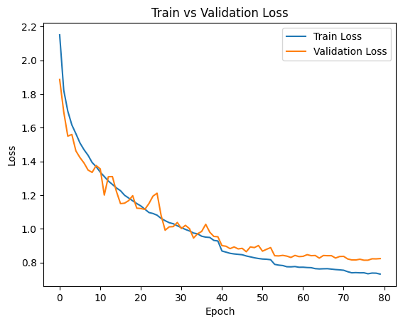
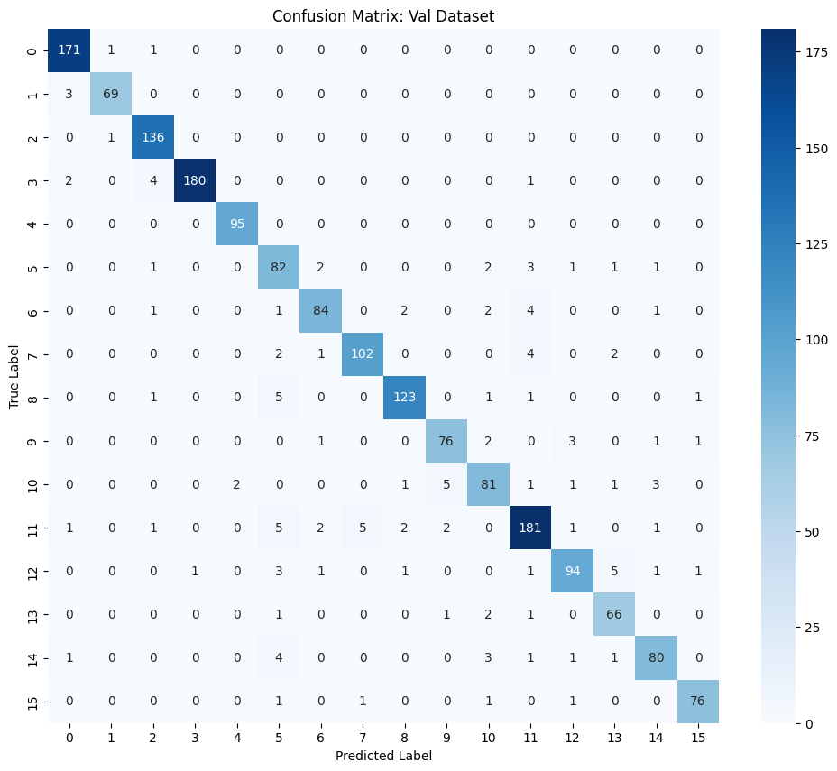
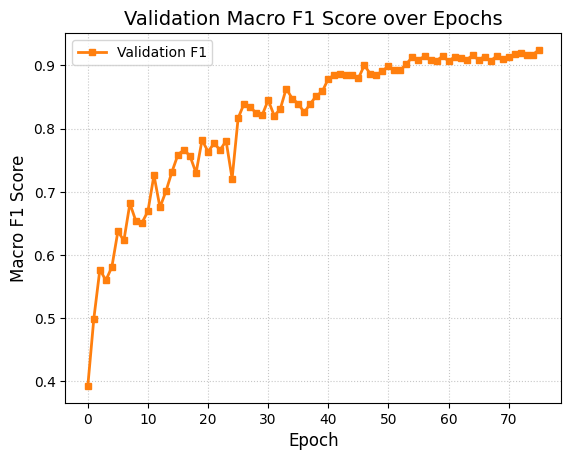

# From-Scratch Multi-Input Deep CNN for Music Genre Classification

A deep Convolutional Neural Network built **entirely from scratch in PyTorch** without relying on standard high-level layers (`nn.Conv2d`, `nn.BatchNorm2d`, `nn.MaxPool2d`, `nn.Linear`, `nn.AdaptiveAvgPool2d`). The model processes synchronized 9-channel multi-input image triplets to classify audio-visual music representations into **16 categories**. Developed for the **CS776 Deep Learning for Computer Vision** competition at IIT Kanpur.

---

## 📌 Project Highlights

* **Custom Primitives From Scratch:** Implemented 2D Convolution, Batch Normalization, Max Pooling, Global Adaptive Average Pooling, and Linear Dense layers using raw tensor operations and `torch.nn.functional.unfold`.
* **Early-Fusion Pipeline:** Fused semantically related image triplets into a unified (9 x 369 x 496) tensor with synchronized geometric data augmentations.
* **Robust Regularization:** Incorporated 0.1 label smoothing, weight decay ($10^{-4}$), and dropout ($p=0.5$) to prevent overfitting and overconfidence across classes.
* **Primary Metric:** **Macro-Averaged F1-Score** to ensure balanced performance across all 16 categories regardless of class distribution.
* **High-Performance Results:** Achieved **94.65% Validation F1-Score** and **94.6% Final Test Accuracy**.

---

## 🏗️ Architecture Design (`CNN_Scratch`)

The architecture consists of a 6-block feature extractor with progressively expanding channel depth, followed by global adaptive pooling and a 2-layer classification head:

```text
Input (9 x 369 x 496)
  │
  ├── Block 1: Conv2D(9 -> 16, 3x3)   -> BatchNorm2D -> ReLU -> MaxPool2D(2x2)
  ├── Block 2: Conv2D(16 -> 32, 3x3)  -> BatchNorm2D -> ReLU -> MaxPool2D(2x2)
  ├── Block 3: Conv2D(32 -> 64, 3x3)  -> BatchNorm2D -> ReLU -> MaxPool2D(2x2)
  ├── Block 4: Conv2D(64 -> 96, 3x3)  -> BatchNorm2D -> ReLU -> MaxPool2D(2x2)
  ├── Block 5: Conv2D(96 -> 128, 3x3) -> BatchNorm2D -> ReLU -> MaxPool2D(2x2)
  ├── Block 6: Conv2D(128 -> 192, 3x3)-> BatchNorm2D -> ReLU -> MaxPool2D(2x2)
  │
  ├── AdaptiveAvgPool2D -> (192 x 1 x 1)
  ├── Flatten -> Linear(192 -> 128) -> ReLU -> Dropout(p=0.5)
  └── Linear(128 -> 16) -> Class Logits

```

* **Total Parameters:** 439,760 trainable parameters
* **FLOPs / Mult-Adds:** ~936.34 MMac

---

## 🔬 From-Scratch Layer Implementations

| Layer Component | Implementation Strategy |
| --- | --- |
| **`Conv2D_Scratch`** | Unfolds input tensor into spatial columns via `F.unfold` and computes convolution as a single batched matrix multiplication (`w @ x_unf`). |
| **`BatchNorm2D_Scratch`** | Calculates batch channel means and unbiased variances dynamically during training while maintaining exponential moving averages for inference. |
| **`MaxPool2D_Scratch`** | Unfolds spatial patches and extracts channel-wise maxima across 2 x 2 receptive fields. |
| **`AdaptiveAvgPool2D_Scratch`** | Dynamically calculates stride/kernel dimensions to reduce arbitrary spatial shapes to fixed 1 x 1 vectors via patch unfolding and mean pooling. |
| **`Linear_Scratch`** | Implements custom He-initialized weight matrices and additive biases (`x @ W.T + b`). |

---

## 🔄 Fusion & Experimentation Analysis

Before selecting the 6-block early fusion architecture, multiple multi-input strategies were evaluated:

* **Late Fusion (Siamese Networks):** Processing each image branch independently led to poor F1 scores due to the inability to learn low-level cross-image correlations.
* **Mid-Fusion:** Merging intermediate features improved representations over late fusion but remained inferior to early concatenation.
* **Residual Connections (ResNet):** Adding residual skip connections caused gradient instability during from-scratch optimization on this dataset scale.
* **Early Fusion (Final):** Channel-wise concatenation into 9 channels allowed shared kernel learning from the very first layer, consistently yielding the highest generalization.

---

## 📊 Training Dynamics & Evaluation

### Training Configuration

* **Epochs:** 80
* **Batch Size:** 32
* **Optimizer:** Adam ($\text{lr} = 5 \times 10^{-4}$, weight decay = $1 \times 10^{-4}$)
* **Scheduler:** `ReduceLROnPlateau` (mode='max', factor=0.5, patience=5, threshold=1e-3)
* **Loss:** Categorical Cross-Entropy with 0.1 Label Smoothing
* **Mixed Precision:** Accelerated with PyTorch AMP (`GradScaler`)

### Key Metrics

| Metric | Score |
| --- | --- |
| **Primary Metric** | **Macro-Averaged F1-Score** |
| **Validation F1-Score** | **94.65%** |
| **Final Test Accuracy** | **94.6%** |

### Performance Visualizations

<p align="center">
  
  
</p>

<p align="center">
  
</p>

## 📁 Repository Structure

```text
├── assets/                          # Visualization plots and confusion matrix
│   ├── loss_curve.png
│   ├── confusion_matrix.png
│   └── val_f1_plot.png
├── DLCV-Assignment.ipynb            # Full runnable Kaggle / Jupyter Notebook
├── best_model.pth                   # Top checkpoint weights
├── submission.csv                   # Test set prediction outputs
├── requirements.txt                 # Dependencies
└── README.md                        # Project documentation

```

---

## 🛠️ Installation & Usage

### 1. Clone & Install Dependencies

```bash
git clone https://github.com/Nishant-ml/From-Scratch-MultiInput-CNN.git
cd From-Scratch-MultiInput-CNN
pip install -r requirements.txt

```

### 2. Run Experiments

```bash
jupyter notebook DLCV-Assignment.ipynb

```

---

## 📦 Dependencies

* Python >= 3.8
* PyTorch >= 2.0.0
* torchvision
* scikit-learn
* pandas
* numpy
* matplotlib
* seaborn
* torchinfo
